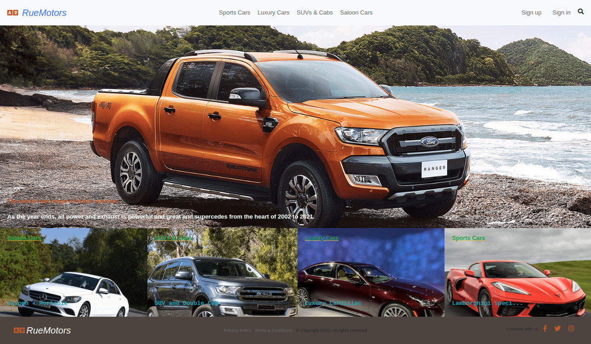

# Lifestyle_Articles Capstone with Ruby on Rails
Lifestyle articles is a real-world-like project, built with business specifications to implement the following MVC specifications accordingly :

1.  Authentication:
-   The user signs up and signs in to the app, only by typing their name.
-   The user signs out of to the app

2.  The user is presented with the homepage with the following features:
-   Featured article with full-width image and title in the first row. This should be the article 
    with the number of highest votes.
-   List of all categories in order of priority.

3.  When the user clicks the category name they can see all articles in that category:
-   Articles are sorted by most recent.
-   Each article displays: image, title, truncated text as preview and its author name.
-   A button to add a vote for article (each user can vote only once).

4.  When user opens "New Article" page:
-   A form with all necessary fields is displayed.

## Built With

- Ruby v2.7.1
- Ruby on Rails v6



## Live Presentation

[Live Presentation Link](https://www.loom.com/share/7f0103f79300496bb1d8078959b20aab)

## Live Demo

[Live Demo Link](https://rue-motors.herokuapp.com/)

## Getting Started

To get a local copy up and running follow these simple example steps.

### Prerequisites

Ruby: 2.7.1
Rails: 6
Postgres: >=9.5

### Setup

Install gems with:

```
bundle install
```

### Add Bootstrap-4 dependencies by running:

```
yarn add bootsrap jquery popper.js'
```

or

```
yarn install
```

Setup database with:

- Reconfigure database.yml file for your local environment (i.e configuring development & test databases) to use a local username & password of your choice & run:

```
rails db:migrate
```
- To clone the repo to your local repository. Follow this steps
- <code> git clone https://github.com/Rumbie-Mudzie7/Lifestlye-articles.git</code>
- <code> cd lifestlye-articles</code>

### Validations
-   Presence of "Name", "Title" and "Text" is enforced to be true.
-   Maximum length of "Title"

### Tests
1.  Model tests on validations and associations:
-   article_spec.rb
-   article_category_spec.rb
-   category_spec.rb
-   user_spec.rb
-   votes_spec.rb

2.  Feature tests for authentication:
-   session_spec.rb

Run rspec in the terminal.

### Usage

Start server with:

```
    rails server
```

Open `http://localhost:3001/` in your browser.

### Run tests

```
    rpsec --format documentation
```

### Deployment


## Author

:bust_in_silhouette: **Rumbidzayi Mudziviri**
- Github: [@Rumbie-Mudzie7](https://github.com/Rumbie-Mudzie7)
- Twitter: [@RumbidzayiMudz3](https://twitter.com/RumbidzayiMudz3)
- Linkedin: [rumbidzayimudziviri](https://www.linkedin.com/in/rumbidzayi-mudziviri)
- rumbiemudzie@gmail.com

## :handshake: Contributing

Contributions, issues and feature requests are welcome!
Feel free to check the [issues page](issues/).

## Show your support

Give a :star:️ if you like this project!

## Acknowledgments
Nelson Sakwa
Microverse
Odin Project
Heroku

## :memo: License

MIT